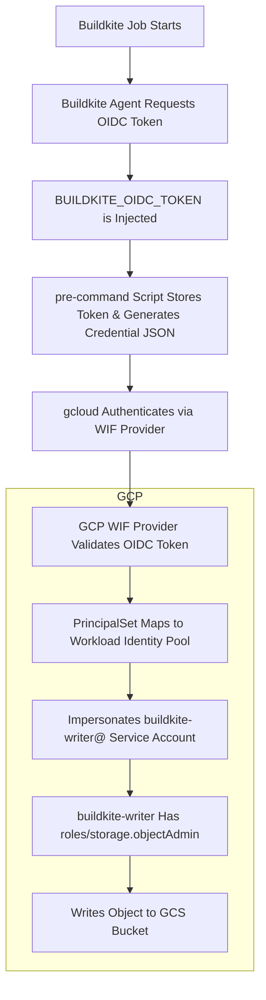

[](https://buildkite.com/theopenlane/gcs-rsync-buildkite-plugin)

# GCS rsync plugin

This plugin uploads files from your pipeline to a Google Cloud Storage bucket using `gsutil rsync`. It runs the Cloud SDK Docker image so you don't need `gcloud` installed on the agent. Instead of using a service account key which isn't a very secure method of credential exchange and management, this repo has been seutp to leverage GCP's [Workload Identity Federation](https://cloud.google.com/iam/docs/workload-identity-federation) setup; you can find overviews of setting this up in GCP with external IdP's [here](https://cloud.google.com/iam/docs/workload-identity-federation-with-other-providers#file-sourced-credentials). Because Buildkite supports [OIDC](https://buildkite.com/docs/pipelines/security/oidc) we can configure our GCP WIP with Buildkite Agent as the OIDC provider; this process looks roughly like:



## Example

Add the following to your `pipeline.yml`:

```yml
steps:
  - command: ":"
    plugins:
      - theopenlane/gcs-rsync#v1.0.4:
          bucket: my-upload-bucket
          source: templates
          project: my-gcp-project
          project-number: "123456789"
          pool-id: "my-pool"
          service-account: "my-sa@my-gcp-project.iam.gserviceaccount.com"
```

### Configuration

* `bucket` (**required**): The name of the GCS bucket to sync to.
* `source`: Local directory to upload (default: `templates`).
* `project` (**required**): GCP project ID.
* `project-number` (**required**): Numeric GCP project number.
* `pool-id` (**required**): Workload identity pool ID.
* `service-account` (**required**): Service account email used for authentication.

The pre-command hook uses the supplied OIDC token file to generate a temporary
credential file with `gcloud iam workload-identity-pools create-cred-config`.
The command hook then authenticates with this file before running
`gsutil rsync`.

The plugin uses `gsutil -m rsync` to synchronize the source directory with the destination bucket.

Tests can be run with `bats tests` from this directory.

## Developing

Provide examples on how to modify and test, e.g.:

To run the linter:
```shell
task lint
```

To run the tests:

```shell
task test
```
## Practical application

If you're like us, you might have super sekretz in some of your repos you want to use in your GCP account - in our case we want to bop our pods on some files we keep in a repo. After using this plugin, you'd be able to do something like:

```yaml
apiVersion: apps/v1
kind: Deployment
metadata:
  name: core
spec:
  replicas: 1
  selector:
    matchLabels:
      app: core
  template:
    metadata:
      labels:
        app: core
    spec:
      serviceAccountName: bucket-mounter
      volumes:
        - name: treasure-map
          emptyDir: {}
      containers:
        - name: core
          image: ghcr.io/theopenlane/core:latest
          volumeMounts:
            - name: treasure-map
              mountPath: /app/treasuremaps
        - name: gcsfuse
          image: gcr.io/gcsfuse/gcsfuse:latest
          command: ["/bin/sh", "-c", "gcsfuse --implicit-dirs treasure-map-bucket /treasuremaps && sleep infinity"]
          securityContext:
            privileged: true
          volumeMounts:
            - name: treasure-map
              mountPath: /treasuremaps
```

You can also see example Config Connector resources in the examples directory which represent the needed GCP resources to accomplish this setup.

## Contributing

1. Fork the repo
1. Make the changes
1. Run the tests
1. Commit and push your changes
1. Send a pull request
